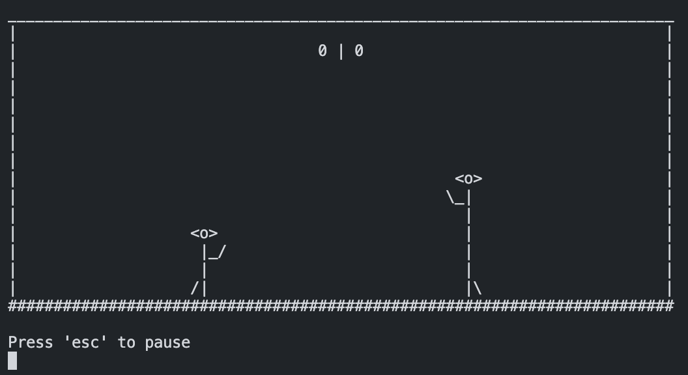
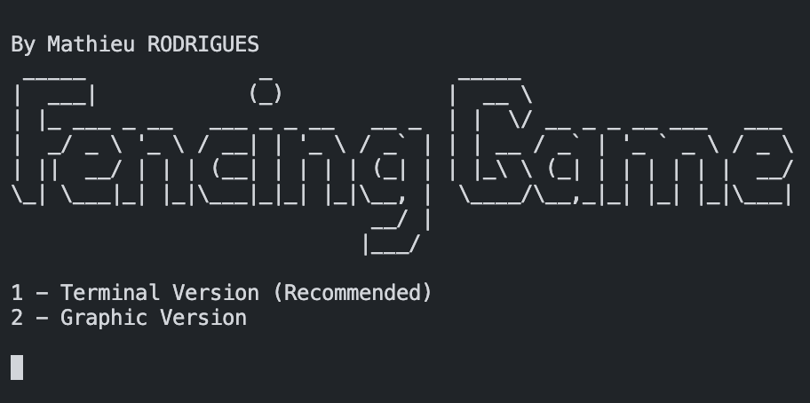

# Fencing Game Python



Projet Master M1 pour le cours de programmation avancé

## Description

Un petit jeu d'escrime codé en python, jouable sur le terminal avec musique et son.

## Guide de démarrage

### Dépendances

* time
* threading
* tkinter
* pygame (for the sound)
* os

### Installation

* [Lien de téléchargement](https://github.com/MathieuRodri/fencing_game_python/releases/tag/v1.0)

### Exécution du programme

* Le jeu se lance via l'éxecution de main.py 
```
python main.py

python3 main.py
```


## Help

Vous constatés des problèmes d'affichage sur la version terminal ?
Vous pouvez agrandir votre terminal afin d'afficher l'entièreté du jeu
Ou modifier les variables x_board (71 par défaut) et y_board (15 par défaut) dans le fichier scene.py
```
#./scene.py

x_board = 31
y_board = 10
```

## Autheur

Noms et coordonnées des contributeurs

RODRIGUES Mathieu | 
[LinkedIn](https://www.linkedin.com/in/mathieu-rodrigues01)
